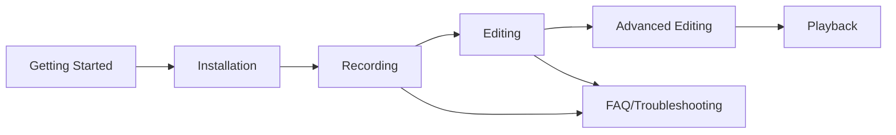

# Docs/user/INDEX.md

User Documentation

## Overview

End-user guides and documentation for StrawberryMaus.

### Getting Started

- [Getting-Started.md](./Getting-Started.md)
  - Quick start guide
  - Initial setup
  - First recording
  - Tags: [#GettingStarted] [#QuickStart] [#Setup]

- [Installation-Permissions.md](./Installation-Permissions.md)
  - Installation process
  - Permission setup (macOS)
  - Troubleshooting installation
  - Tags: [#Installation] [#Permissions] [#Setup]

### Recording & Editing

#### Recording

- [Recording-Guide.md](./Recording-Guide.md)
  - Recording workflows
  - Capture settings
  - Best practices
  - Tags: [#Recording] [#Capture] [#UserGuide]

#### Editing

- [Editing-Guide.md](./Editing-Guide.md)
  - Timeline editing
  - Node manipulation
  - Basic workflows
  - Tags: [#Editing] [#Timeline] [#UserGuide]

- [Advanced-Editing.md](./Advanced-Editing.md)
  - Advanced techniques
  - Batch operations
  - Complex workflows
  - Tags: [#AdvancedEditing] [#PowerUser] [#Workflows]

#### Playback

- [Playback-Guide.md](./Playback-Guide.md)
  - Playback controls
  - Verification methods
  - Export options
  - Tags: [#Playback] [#Verification] [#Export]

### Help & Support

- [FAQ.md](./FAQ.md)
  - Frequently asked questions
  - Common solutions
  - Tips and tricks
  - Tags: [#FAQ] [#Help] [#Questions]

- [Troubleshooting.md](./Troubleshooting.md)
  - Problem diagnosis
  - Solution steps
  - Error messages
  - Tags: [#Troubleshooting] [#Errors] [#Solutions]

- [Shortcuts.md](./Shortcuts.md)
  - Keyboard shortcuts
  - Quick actions
  - Productivity tips
  - Tags: [#Shortcuts] [#Keyboard] [#Productivity]

### User Journey



### document_matrix

| Stage | Documents | Difficulty |
|-------|-----------|------------|
| Setup | Getting-Started, Installation-Permissions | Beginner |
| Recording | Recording-Guide | Beginner |
| Editing | Editing-Guide | Intermediate |
| Advanced | Advanced-Editing | Advanced |
| Playback | Playback-Guide | Intermediate |
| Support | FAQ, Troubleshooting, Shortcuts | All levels |

### exports

- `GettingStarted` - Quick start guide
- `Installation` - Installation guide
- `Recording` - Recording workflows
- `Editing` - Editing guide
- `AdvancedEditing` - Advanced techniques
- `Playback` - Playback guide
- `FAQ` - Frequently asked questions
- `Troubleshooting` - Problem solving
- `Shortcuts` - Keyboard shortcuts

### idex_links

- Parent: [../INDEX.md](../INDEX.md)
- Module Guides: [../modules/INDEX.md](../modules/INDEX.md)
- Support: [../support/INDEX.md](../support/INDEX.md)
- Reference: [../reference/INDEX.md](../reference/INDEX.md)

### maus_tags

[#UserDocumentation] [#Guides] [#EndUser]

---

## Implementation Instructions

### File Placement

Create each INDEX.md file in its respective directory:

1. `/INDEX.md` - Root index (already exists)
2. `/Docs/INDEX.md` - Main docs index
3. `/Docs/architecture/INDEX.md` - Architecture index
4. `/Docs/json/INDEX.md` - JSON docs index
5. `/Docs/modules/INDEX.md` - Module guides index
6. `/Docs/reference/INDEX.md` - Reference docs index
7. `/Docs/support/INDEX.md` - Support docs index
8. `/Docs/user/INDEX.md` - User docs index

### Features of Each Index

1. **Overview Section**: Describes the directory's purpose
2. **Module Structure**: Visual representation when helpful
3. **File Listings**: Complete with descriptions and tags
4. **Export Declarations**: Similar to Python's `__all__`
5. **Related Links**: Navigation to parent and sibling indices
6. **Tags**: Consistent tagging for searchability
7. **Matrices/Tables**: Quick reference for complex relationships

### Usage Patterns

```javascript
// Import pattern example
import { BerryTimeline, BerryWindow } from './Docs/architecture/INDEX.md';
import { GettingStarted, Installation } from './Docs/user/INDEX.md';
```

### Benefits

1. **Modular Organization**: Each directory is self-documenting
2. **Clear Navigation**: Easy to find related content
3. **Export Control**: Explicit exports like Python modules
4. **Searchability**: Comprehensive tagging system
5. **Maintainability**: Update index when adding/removing files
6. **Discoverability**: Clear structure for new contributors
